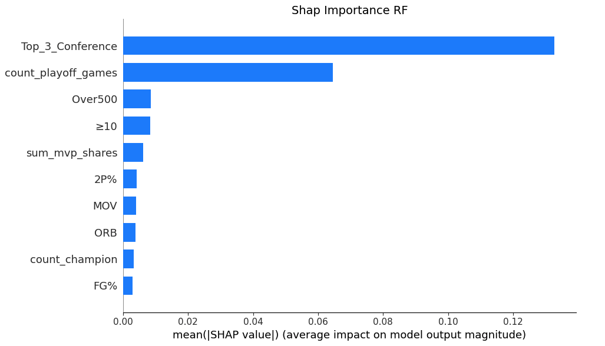

# ai-nba-predict: Predicting the NBA Champion

## Project Members

| Name | Organization | Department | Email |
| --- | --- | --- | --- |
| Youssef Ben Khelil | Paris Institute of Digital Technology | Information Systems | <youssef.ben-khelil@eleve.isep.fr> |
| Leo Bertazzoli | Zurich University of Applied Sciences | Business Information Systems with Data Science | <leobe@gmx.ch> |
| Chang Won Jung | Hanyang University | Information Systems | <richardj0916@hanyang.ac.kr> |

## I. Introduction

### i. Background

The National Basketball Assosciation (NBA) is a North American basketball league made up of 30 teams. Every year from October to April, the teams compete in a regular season tournament of 82 games each, in order to determine their seeding in the playoffs. The top 8 teams in each conference are placed in the playoff bracket, where the eventual winner is crowned the NBA Champion.

Predicting winners in sports has been a notoriously difficult challenge. Another basketball event that highlights this difficulty is March Madness, a US college basketball event held in march. Many people try to predict the bracket of tournament, but the sheer unpredictability of the task makes it extremely difficult. It is this difficulty that our group wants to explore.

### ii. Motivations

The motivations for this project are as follows. First, our group has a general interest in sports, particularly the NBA. Because we are fans of the NBA, we thought that it would be a fun project to see if the champions of future seasons could be accurately predicted. Second, we wanted to discover which statistics, or what characteristics of a team truly make them championship contenders. Finally, although we do not wish to promote unhealthy or irresponsible gambling, success in creating an accurate model could be used for making small bets.

## II. Dataset

### i. Description

Like many sports leagues, the NBA tracks and records various statistics from all of their games. These statistics range from simple statistics such as field goal percentage (FG%), to advanced statistics such as effective field goal percentage (eFG%). [Baksetball Reference](https://www.basketball-reference.com/)<sup>[[1]](#v-related-work)</sup> provides a massive collection of NBA statistics from team stats to individual player statistics.


*Figure 1: Team stats of the 2023 NBA season, provided by Basketball Reference.*

Although we will be explaining certain key statistics in the following sections of our project, due to sheer vast number of statis available, not every statistics will be explained. To get more detailed descriptions of the statistics, please take a look at a [statistics glossary](https://www.basketball-reference.com/about/glossary.html)<sup>[[2]](#v-related-work)</sup>.

### ii. Dataset Used

The dataset that we used for our project was provided by [JK-Future-Github](https://github.com/JK-Future-GitHub/NBA_Champion/tree/main)<sup>[[3]](#v-related-work)</sup>, who used a web crawler to collect data from Basketball Reference. This included every single team from the 1950 to 2023 NBA season, for a total of 1604 rows.

He also added additional features to the dataset. One example is Top_3_Conference, which describes whether the team finished within the top 3 in their respective conference. With these additional columns, the dataset had a total of 94 columns.

### iii. Alterations to Dataset

After analyzing the dataset, we decided to make some alterations to the dataset. One thing that we noticed was that the rows for the teams prior to the 1980 NBA season had a lot of missing values. The reasoning was that the NBA introduced the three point line in 1980. As a result, any data from seasons prior to 1980 did not have any statistics related to the three point shot, and was extremely sparse. As a result, we removed teams from any seasons before 1980.

We also decided to removed the 2023 season from our dataset. The reasoning was because at the point in time when the data collected, the 2023 season was yet to be completed. By removing these rows, our final dataset had a total of 1195 rows.

We also decided to remove some columns from the dataset that we thought were either unnecessary or would contribute to noisy data. One example is the win and lose columns. Although the NBA season is generally 82 games, in several seasons of the NBA the season has been shortened. Although a team with 40 wins is usually considered sub-par, in shortened seasons 40 wins would be considered great, thus adding noise. After removing such columns, our final dataset had 79 columns.

A final thing that we discovered was that the ```Champion_Win_Share``` column was incorrect for some rows of data. Because ```Champion_Win_Share``` was our target feature, any errors in this column were considered critical. In the 1980 and 1982 seasons, errors in the dataset made it so that there were multiple championship teams. We edited the dataset to correctly reflect the actual ```Champion_Win_Share```.

The final dataset that we used had a total of 79 columns and 1195 rows.

## III. Methodology

### i. Algorithms

We decided to use different regression algorithms and compare the results of each algorithms predictions. The two algorithms that we chose were Gradient Boosting and Random Forest.

The reason for choosing these two models were not only due to their high accuracy and prediction accuracy, but also because they provide information on feature importance. Because one of our motivations of the project was to determine which statistics are the most important to determining what makes an NBA team a championship contender, feature importance was important to us.

We used the libraries provided by [XGBoost](https://xgboost.readthedocs.io/en/stable/index.html)<sup>[[4]](#v-related-work)</sup> and [scikit-learn](https://scikit-learn.org/stable/index.html)<sup>[[5]](#v-related-work)</sup>:

``` python
import pandas as pd
import matplotlib.pyplot as plt
import numpy as np
import random
from xgboost import XGBRegressor
from sklearn.ensemble import RandomForestRegressor
from sklearn.metrics import mean_squared_error
import shap
```

### ii. Training and Test Data

First, we divided the dataset into training and test data. Instead of a complete random splitting of the dataset, we decided to randomly select two seasons from each decade. The reasoning behind this method is because the NBA game has evolved with time, causing changes in playstyles which altered which skillsets were considered valuable to winning. For example, the modern NBA has seen the rise and absolute necessity of having good three point shooting, whereas in previous eras the three point shot was considered an inefficient shot.

``` python
#Read CSV and drop empty values
nba_stats = pd.read_csv('nba_team_data.csv')
nba_stats = nba_stats.dropna()

#Create feature columns
exclude_columns = ['season', 'name', 'conference', 'Champion_Win_Share']
feature_columns = [col for col in nba_stats.columns if col not in exclude_columns]

random_seed = 12345
random.seed(random_seed)

#Split by randomly selecting 2 Seasons each decade and save in train_set and test_set
nba_stats['season'] = nba_stats['season'].astype(str)
nba_stats['Decade'] = nba_stats['season'].apply(lambda x: x[:3] + '0')
unique_decades = nba_stats['Decade'].unique()
train_set = pd.DataFrame()
test_set = pd.DataFrame()
for decade in unique_decades:
    decade_data = nba_stats[nba_stats['Decade'] == decade]
    
    # Randomly select two seasons for the test set
    test_seasons = random.sample(list(decade_data['season']), k=2)
    test_set = pd.concat([test_set, decade_data[decade_data['season'].isin(test_seasons)]])
    train_set = pd.concat([train_set, decade_data[~decade_data['season'].isin(test_seasons)]])

train_set = train_set.drop(columns=['Decade'])
test_set = test_set.drop(columns=['Decade'])

#Save test season list
test_seasons = test_set['season'].unique()
```

### iii. Target Feature

The target feature is ```Champion_Win_Share```. This is defined to be the total wins that a team gets in the playoffs divided by the max number of wins that a team can get (16 wins). A team with a greater number of playoff wins will have a higher ```Champion_Win_Share```, and be considered to be more successful. The championship team will have a value of 1.

The end goal will be use a single season's data on our model to estimate each team's ```Champion_Win_Share```. The team with the highest ```Champion_Win_Share``` will be considered as the winner of that NBA season.

``` python
#Create the feature and target sets
X_train = train_set[feature_columns]
y_train = train_set['Champion_Win_Share']
X_test = test_set[feature_columns]
y_test = test_set['Champion_Win_Share']
```

### iv. Model Fitting and Predictions

We then trained our model and made predictions with the test dataset.

``` python
# Set random seed for models
random_seed = 6789
random.seed(random_seed)

xgb_model = XGBRegressor(random_state=random_seed)
xgb_model.fit(X_train, y_train)

rf_model = RandomForestRegressor(random_state=random_seed)
rf_model.fit(X_train, y_train)

xgb_predictions = xgb_model.predict(X_test)
rf_predictions = rf_model.predict(X_test)

test_set['XGB_Predicted_Champion'] = xgb_predictions
test_set['RF_Predicted_Champion'] = rf_predictions
```

## IV. Evaluation and Analysis

### i. Root Mean Squared Error

Calculations of the Root Mean Square Error of XBG and Random Forest suggested that the Random Forest algorithm was slightly more accurate than Gradient Boosting.

``` python
xgb_rmse = np.sqrt(mean_squared_error(y_test, xgb_predictions))
rf_rmse = np.sqrt(mean_squared_error(y_test, rf_predictions))

print("XGBoost Mean Squared error:")
print(xgb_rmse)
print("Random Forest Mean Squared error:")
print(rf_rmse)
```


*Figure 2: Root Mean Square Error results of XGB and RF.*

### ii. Prediction Results

We tested each NBA season from our test dataset for both models, and received the following results:

``` python
for season in test_seasons:
    print(f"\nResults for {season} Season:")
    
    xgb_output = test_set[(test_set['season'] == str(season))][['name', 'XGB_Predicted_Champion','Champion_Win_Share']].sort_values(by='XGB_Predicted_Champion', ascending=False).head(8)
    print("XGBoost Predictions:")
    print(xgb_output)
    
    rf_output = test_set[(test_set['season'] == str(season))][['name', 'RF_Predicted_Champion','Champion_Win_Share']].sort_values(by='RF_Predicted_Champion', ascending=False).head(8)
    print("\nRandom Forest Predictions:")
    print(rf_output)
```


*Figure 3: XGB and RF prediction results for most recent NBA season (2022) and earliest NBA season (1985) from test dataset.*

Although both the Gradient Boosting model and the Random Forest model yielded relatively similar results, Random Forest was found to be slightly more accurate.

| Seeding Offset | XGBoost | Random Forest |
| --- | --- | --- |
| 0 (Correct) | 4 | 6 |
| 1  | 3 | 2 |
| 2  | 1 | 1 |
| > 3  | 2 | 1 |

Below is a scatterplot of XGBoost and Random Forest predictions compared to the actual ```Champion_Win_Share```.

``` python
# Visualization
plt.scatter(y_test, xgb_predictions, label="XGBoost Predictions")
plt.scatter(y_test, rf_predictions, label="Random Forest Predictions")
plt.xlabel("Actual Champion_Win_Share")
plt.ylabel("Predicted Champion_Win_Share")
plt.legend()
plt.show()
```


*Figure 4: Scatterplot of Actual Champion_Win_Share vs. Predicted Champion_Win_Share.*

### iii. Shap Importance

According to the creators of [SHAP](https://shap.readthedocs.io/en/latest/index.html)<sup>[[6]](#v-related-work)</sup>, "SHAP (SHapley Additive exPlanations) is a game theoretic approach to explain the output of any machine learning model." Using the SHAP library, we analyzed our results to see which features were the most important in determining ```Champion_Win_Share```.

``` python
# Explain XGBoost predictions with SHAP
explainer_xgb = shap.Explainer(xgb_model)
shap_values_xgb = explainer_xgb.shap_values(X_test)

# Explain Random Forest predictions with SHAP
explainer_rf = shap.Explainer(rf_model)
shap_values_rf = explainer_rf.shap_values(X_test)

# Summary plot for XGBoost
shap.summary_plot(shap_values_xgb, X_test, feature_names=feature_columns, plot_type="bar", show=False, max_display=10)

fig = plt.gcf()
fig.set_size_inches(10, 6)
plt.title("Shap Importance XGB", fontsize=14, loc="center")   
plt.tight_layout()
plt.show()

# Summary plot for Random Forest
shap.summary_plot(shap_values_rf, X_test, feature_names=feature_columns, plot_type="bar", show=False, max_display=10)

fig = plt.gcf()
fig.set_size_inches(10, 6)
plt.title("Shap Importance RF", fontsize=14, loc="center")   
plt.tight_layout()
plt.show()
```


*Figure 5: SHAP Importance graph for XGB.*


*Figure 6: SHAP Importance graph for RF.*

As shown in the graphs above, the Gradient Boosting and Random Forest algorithm determined a similar set of features to be the most important in determining whether or not an NBA team wins a championship. The five most important features of both models are not only identical but also in the same order. Furthermore, the two models also share three other features within the top 10 most impactful features.

| Feature | Explanation |
| --- | --- |
| Top_3_Conference | True/False value on whether the team finished within the top 3 seeds in the regular season.|
| count_playoff_games | The total number of playoff games played by the players on the team. |
| Over500 | Winrate against teams with a positive winrate |
| >= 10 | Winrate with score differentials over 10 points |
| sum_mvp_shares | Indication of whether the team has a super star player |
| count_champion | Number of NBA champion players on the team |
| 2P% | Two point percentage |
| MOV | Margin of victory |

## V. Related Work

1. [Baksetball Reference (Statistics Database)](https://www.basketball-reference.com/)
1. [Statistics Glossary](https://www.basketball-reference.com/about/glossary.html)
1. [JK-Future-Github (Dataset and inspiration)](https://github.com/JK-Future-GitHub/NBA_Champion/tree/main)
1. [XGBoost (Gradient Boost)](https://xgboost.readthedocs.io/en/stable/index.html)
1. [scikit-learn (Random Forest)](https://scikit-learn.org/stable/index.html)
1. [SHAP (ML Model Analysis)](https://shap.readthedocs.io/en/latest/index.html)

## VI. Conclusion

The results showed that in order for an NBA team to win the championship, they must have these qualities:

1. They must finish high in seeding (```Top_3_Conference```)
1. They must have previous playoff experience and success (```count_playoff_games```, ```count_champion```)
1. They must be dominant (```Over500```, ```>=10```, ```MOV```)
1. They should have super star players (```sum_mvp_shares```)

Although it may appear to be difficult, our project shows that it is not completely impossible to accurately predict which NBA team will win the NBA championship. The Random Forest model was correct 60% of the time, and was within 2 seeds 90% of the time. Even the less accurate Gradient Tree model was within 2 seeds 80% of the time. Due to these results, we concluded that we would not risk making any bets based on the prediction models.

Further improvements to the model can be made. One change that can be implemented is a feature that takes injury or injury risk into consideration. Injuries can take a championship contending team completely out of the picture. If a feature that takes this aspect into account, it may remove any potential randomness in the data.

An example would be the 2021 NBA season, where both Gradient Boosting and Random Forest predicted the Brooklyn Nets to finish highly, but they were knocked out very early. The reasoning was that two of their three top players were out due to injury, and they ended up losing to the eventual champions.

[Video Presentation (YouTube)](https://www.youtube.com/)